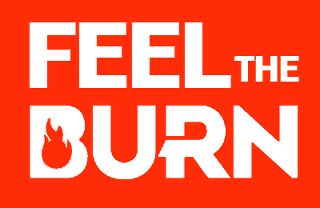

<h1 align="center">
     
    
     
    :fire: Feel the Burn 🔥
     
</h1>

## Table of Contents
* [About the Project](#about-the-project)

## About the Project 

_Feel the Burn is a project about an app to organize your workout without matter the type of sport(calisthenic, gym, yoga, etc.)_

## Author ✒️

* **Marcos Rodríguez** - *Progamming and Documentation* - [Github](https://github.com/mark-doblefilo) - [Twitter](https://github.com/mark_doblefilo) - [Linkedin](https://www.linkedin.com/in/marcos-rodr%C3%ADguez-8b1441195/)
